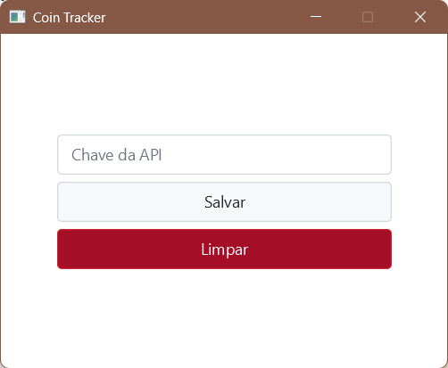

<div align="center">


# 💱 Coin Tracker

**Acompanhe cotações de moedas em tempo real, converta valores e visualize históricos de até 365 dias — tudo em um único aplicativo desktop.**

</div>

---

## Sobre o Projeto

O **Coin Tracker** é um aplicativo desenvolvido com **Java 21 + JavaFX**, que consome a [AwesomeAPI](https://docs.awesomeapi.com.br/).

Desenvolvido como projeto acadêmico, o sistema oferece uma interface intuitiva com três módulos principais: cotações atualizadas, conversor de moedas e histórico com gráfico de variações.

---

## Funcionalidades

### Cotações em Tempo Real
- Listagem de diversas moedas (fiats e criptomoedas) com valor atual em BRL (Real Brasileiro)
- Exibição de **Alta**, **Baixa** e **Variação** do dia
- Gráfico de variação diária atualizado ao clicar em "Atualizar"
- Indicador visual de carregamento durante a busca dos dados

### Conversor de Moedas
- Conversão entre qualquer par de moedas disponíveis na API
- Histórico das conversões realizadas na sessão atual
- Cálculo com taxas de câmbio em tempo real

### Histórico de Cotações BRL
- Busca de histórico de até **365 dias** de qualquer moeda
- Tabela com dados de Fechamento, Alta, Baixa e Variação por data
- Gráfico de linha ilustrando a evolução da cotação no período

### Configurações
- Gerenciamento da chave de API diretamente na interface
- Opções de salvar e limpar a chave configurada

---

## Interface

<table>
  <tr>
    <td align="center"><b>Cotações</b></td>
    <td align="center"><b>Conversor</b></td>
  </tr>
  <tr>
    <td></td>
    <td></td>
  </tr>
  <tr>
    <td align="center"><b>Histórico de Cotações</b></td>
    <td align="center"><b>Chave da API</b></td>
  </tr>
  <tr>
    <td></td>
    <td></td>
  </tr>
</table>

---

## Tecnologias Utilizadas

| Tecnologia | Descrição |
|---|---|
| Java 21 | Linguagem principal da aplicação |
| JavaFX | Framework para a interface gráfica desktop |
| Maven | Gerenciamento de dependências e build |
| AwesomeAPI | API pública de cotações de moedas e criptos |

---

## Como Executar

### Pré-requisitos

- Ter uma chave de API da [AwesomeAPI](https://docs.awesomeapi.com.br/) (Opcional/Gratuito)

### Windows

1. Baixe o instalador `.exe` na seção [Releases](../../releases)
2. Execute o instalador e siga as instruções
3. Abra o **Coin Tracker** pelo atalho criado
4. Vá em **Configurações**, insira sua chave de API e clique em **Salvar**

### Linux

1. Baixe o pacote `.deb` ou `.rpm` na seção [Releases](../../releases)
2. Instale o pacote:
   ```bash
   # Debian/Ubuntu
   sudo dpkg -i coin-tracker.deb

   # Fedora/RHEL
   sudo rpm -i coin-tracker.rpm
   ```
3. Execute o aplicativo pelo menu ou pelo terminal:
   ```bash
   coin-tracker
   ```
4. Vá em **Configurações**, insira sua chave de API e clique em **Salvar**

### Rodando pelo Código-Fonte

Se preferir compilar manualmente:

```bash
# Clone o repositório
git clone https://github.com/filipemartinsdev/coin-tracker.git
cd coin-tracker

# Compile e execute com Maven
mvn clean javafx:run
```

---

## Configuração da API

O Coin Tracker utiliza a **AwesomeAPI** para obter as cotações em tempo real.

1. Acesse [docs.awesomeapi.com.br](https://docs.awesomeapi.com.br/) e obtenha sua chave gratuita
2. Abra o aplicativo, clique em **Configurações** (canto superior)
3. Cole sua chave no campo **Chave da API** e clique em **Salvar**

---

## Conventional Commits

Este projeto adota o padrão [Conventional Commits](https://www.conventionalcommits.org/pt-br/) para manter um histórico de commits claro e organizado.

### Formato

```
<tipo>(escopo opcional): <descrição curta>
```

---

## Equipe

<table>
  <tr>
    <td align="center">
      <b>Thiago Monteiro</b><br/>
      <sub>Líder de Documentação & Dev</sub><br/>
      <a href="https://github.com/ThiHughes">@thiago-monteiro</a>
    </td>
    <td align="center">
      <b>Filipe Martins</b><br/>
      <sub>Product Owner, Líder Técnico & Dev</sub><br/>
      <a href="https://github.com/filipemartinsdev">@filipe-martins</a>
    </td>
  </tr>
</table>

---

<div align="center">
  <sub>Desenvolvido com Java e muito ☕</sub>
</div>
